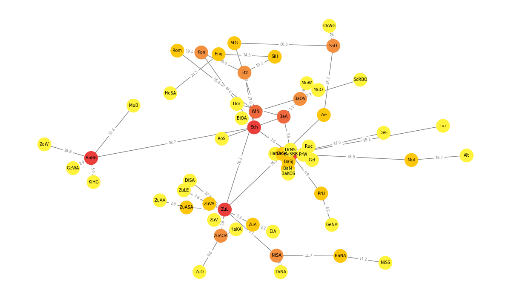
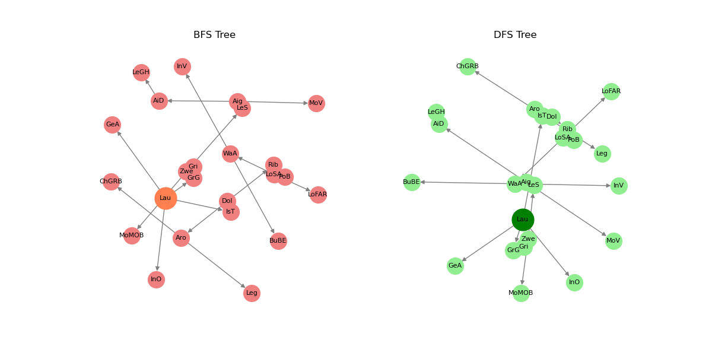

# Graph Analysis and Visualization

I decided to take the real-world data and to analyse it. This decision cost me a lot of time. Data that I was using can be found and downloaded [here](https://data.sbb.ch/explore/dataset/linie/information/?location=7,47.67648,9.38232&basemap=00c4d6). The dataset represents the lines of the SBB railway network in Switzerland. I've downloaded the csv file which is stored at `hw_06/data/linie.csv`

## Modelling
### Data Selection & Preparation
I've selected the following information from the dataset to include into the model of the graph:
* `line_id` - for identifying the individual lines
* `line_name` - just in case I wanted it later for representation purposes
* `start_loc_name` - starting location (node) of the line
* `end_loc_name` - end location (node) of the line
* `start_km` - where the line starts
* `end_km` - where the line ends
### Graph Design
* Edges
  * Line represents an edge in the graph
  * The edge doesn't have a direction
    * every edge is bidirectional
    * if there is a line between location A and B, we can get A --> B and B --> A
  * The lines connecting location to itself were ignored
* Nodes
  * Start and end locations represent the nodes that are connected by the line
    * The names of the locations were shortened to serve as node label 
* Edge Attributes
  * The distance between the `start_km` and `end_km` represents the `distance` between two nodes
  * `weight` of the edge is the inverse of the `distance` 
    * positioning algorithms that consider `weight` interpret larger weight as stronger connection
    * the nodes with 'stronger' connection are drawn closer to each other

## Visualisation
The visualization was the hardest part of the task. Choosing the layout that makes graph more or less readable is a challenge.
* `nx.spring_layout()` was chosen to position the nodes and edges, choosing the `scale` that would produce the best spaced out result was a matter of great patience
* `seed=42` was provided to make the generated visualization more stable
* the edges are labeled with `distance` between two locations (or nodes)
* the color of the node depends on the number of outgoing (incoming) edges -- the _degree_ of the node
  * the closer to red -- the higher degree

## Analysis
For the whole graph :
1. Number of nodes = **589**
2. Number of edges = **417**
3. Clustering coefficient of the graph = ~ **0.0013**
4. Average shortest path length - not defined for the graph that is not connected
5. Number of connected components = **174**
6. Size of the largest connected component = **57**

For the largest connected subgraph:
1. Number of nodes = **57**
2. Number of edges = **58**
3. Clustering coefficient of the graph = ~ **0.0135**
4. Average shortest path length - ~ **5.23**
5. Number of connected components = **1**
6. Size of the largest connected component = **57**

We can see that:
* The clustering coefficient for the connected subgraph is 10 times higher than for the whole graph that is not connected
* Number of edges is significantly smaller than number of nodes in the graph that is not connected

## BFS & DFS
For creating the table of visits to the nodes, the standard implementations of the BFS and DFS were used:
* `bfs(graph)` uses a `queue` to visit the neighbors and only then the children
* `dfs(graph)` uses s `stack` to go deep and visit the children first
### The sequence of visiting the nodes
> From the table of visits of specific locations (nodes), we can see that at every step except the first one (the root node), the visited nodes are different

| Step | BFS Node | DFS Node |
|------|----------|----------|
| 0    | Lau      | Lau      |
| 1    | GrG      | IsT      |
| 2    | InO      | DoI      |
| 3    | GeA      | Aro      |
| 4    | IsT      | Leg      |
| 5    | Gri      | ChGRB    |
| 6    | DoI      | Rib      |
| 7    | Zwe      | PoB      |
| 8    | Rib      | LoSA     |
| 9    | Aro      | WaA      |
| 10   | LeS      | BuBE     |
| 11   | MoMOB    | InV      |
| 12   | PoB      | LoFAR    |
| 13   | ChGRB    | GeA      |
| 14   | Leg      | InO      |
| 15   | Aig      | GrG      |
| 16   | LoSA     | Gri      |
| 17   | MoV      | Zwe      |
| 18   | AiD      | MoMOB    |
| 19   | LoFAR    | LeS      |
| 20   | WaA      | Aig      |
| 21   | LeGH     | AiD      |
| 22   | InV      | LeGH     |
| 23   | BuBE     | MoV      |
### Visualisation of DFS- & BFS-Tree
* The root node is larger and brighter
* From the tree representation it is difficult to say which algorithm was used for building it

## Dijkstra 

